# Geni Architecture

Comprehensive architecture documentation for Geni, a Python-powered infrastructure-as-code compiler.

---

## 1. System Overview

Geni takes declarative YAML target files and compiles them into concrete infrastructure artifacts -- Terraform configurations, Kubernetes manifests, and Helm charts.

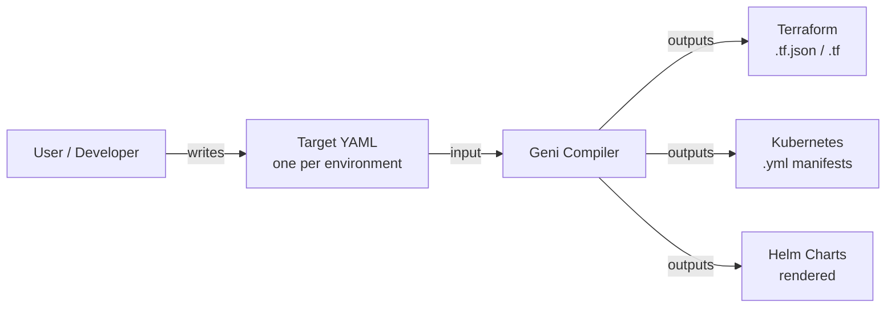

The compiler acts as a single translation layer between human-authored declarations and tool-specific output formats. One YAML file per environment drives all infrastructure generation consistently.

---

## 2. Core Architecture

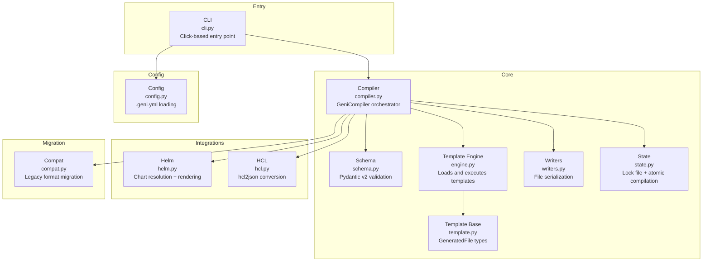

| Component | File | Responsibility |
|-----------|------|---------------|
| **CLI** | `cli.py` | Parses commands and flags, dispatches to the compiler |
| **Compiler** | `compiler.py` | Central orchestrator -- validation, rendering, output |
| **Schema** | `schema.py` | Pydantic models for target YAML validation |
| **Engine** | `engine.py` | Discovers, loads, and executes templates |
| **Templates** | `template.py` | Base classes and GeneratedFile types |
| **Writers** | `writers.py` | Serializes GeneratedFile objects to disk |
| **State** | `state.py` | Lock files and atomic staging/swap |
| **Helm** | `integrations/helm.py` | Chart resolution (local + registry) and rendering |
| **HCL** | `integrations/hcl.py` | HCL-to-JSON conversion via hcl2json |
| **Compat** | `compat.py` | Legacy target format detection and migration |
| **Config** | `config.py` | Project-level `.geni.yml` configuration |

---

## 3. Compilation Flow

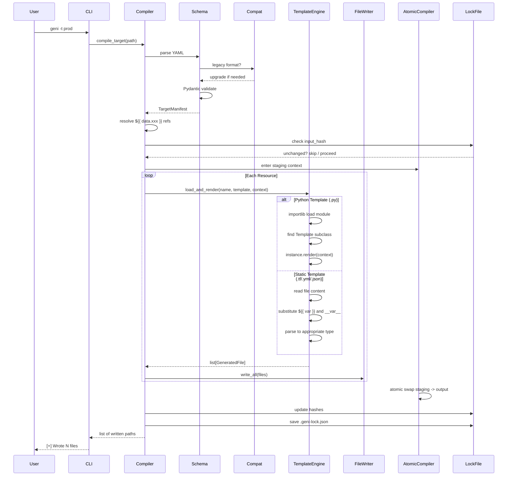

Key properties:

- **Validation-first**: target YAML is fully validated before any rendering begins
- **Reference resolution**: `${{ data.xxx }}` refs resolved after validation, before rendering
- **Atomic output**: files written to staging, swapped in one operation -- no partial writes

---

## 4. Template System

### Two Template Modes

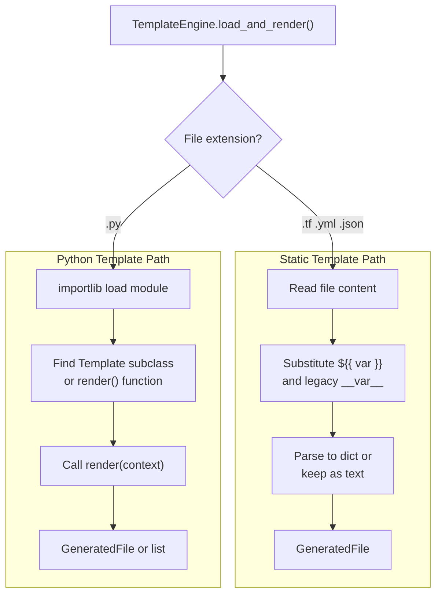

### Class Hierarchy

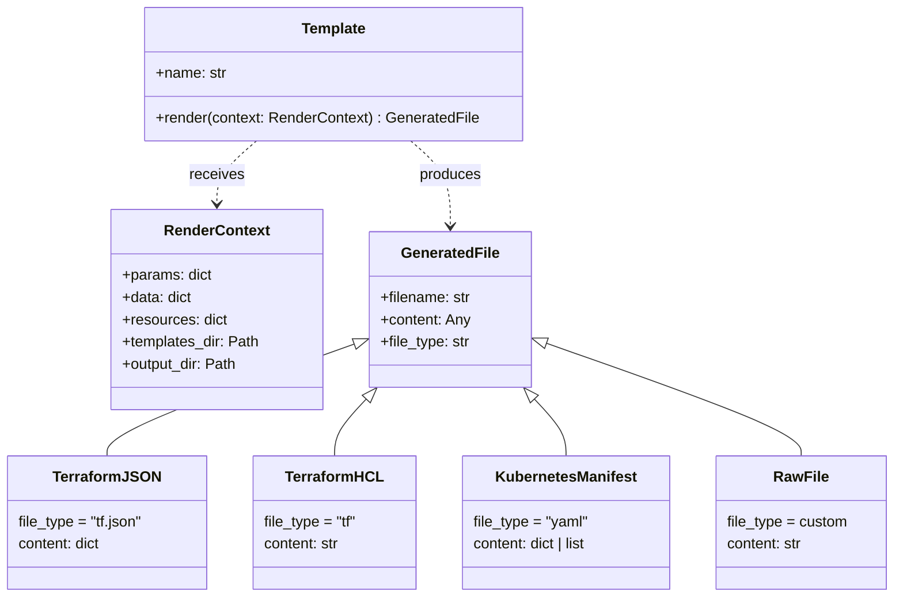

**Static templates** are files with `${{ var }}` placeholders. Best for simple, mostly-literal configurations.

**Python templates** extend the `Template` base class with full Python logic -- loops, conditionals, API calls, multi-file output. A single Python template can return a list of `GeneratedFile` objects, acting as both template and generator.

---

## 5. Target YAML Schema


Each resource must specify exactly one of `template`, `chart`, or `generator`. The `params` dict is passed to the template at render time, with `${{ data.xxx }}` references resolved from the top-level `data` block.

---

## 6. State Management

### Atomic Compilation

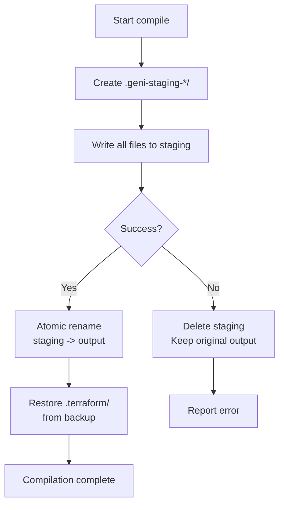

### Incremental Compilation

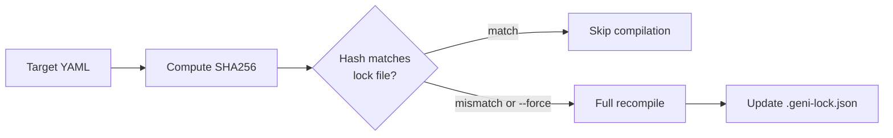

Lock file structure (`.geni-lock.json`):

```json
{
  "version": 1,
  "compiled_at": "2026-03-19T09:17:43+00:00",
  "targets": {
    "example-prod": {
      "input_hash": "sha256:abc123...",
      "outputs": {
        "backend.tf.json": "sha256:def456...",
        "provider.tf.json": "sha256:789abc..."
      }
    }
  }
}
```

The `.terraform/` directory is preserved across compilations -- it is backed up before swap and restored after.

---

## 7. Plugin Architecture

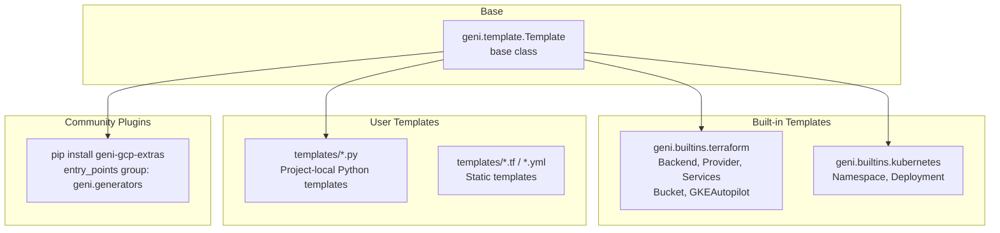

Templates are discovered from three sources:

1. **Local templates** -- files in the project's `templates/` directory (referenced by relative path)
2. **Built-in templates** -- shipped with Geni in `geni.builtins`
3. **Community plugins** -- installed via pip, registered under `geni.generators` entry points

---

## 8. User Workflows

### New Project

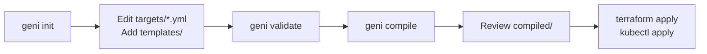

### Development Cycle

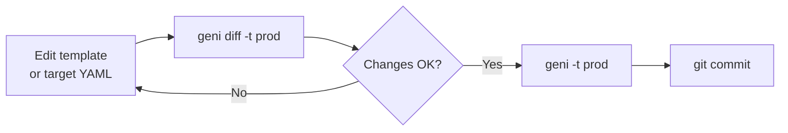

### CI/CD Pipeline

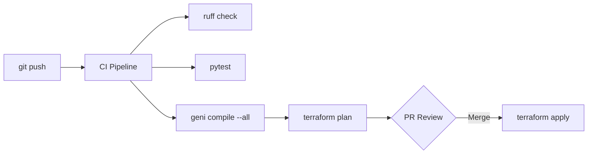

---

## 9. Design Patterns

| Pattern | Where | Purpose |
|---------|-------|---------|
| **Strategy** | `TemplateEngine._render_python_template` vs `_render_static_template` | Different rendering strategies based on file type |
| **Factory** | `TemplateEngine.load_and_render` | Discovers and instantiates Template subclasses dynamically |
| **Builder** | `GeneratedFile` subclasses (`TerraformJSON`, `KubernetesManifest`) | Construct output artifacts with type-specific defaults |
| **Context Manager** | `AtomicCompiler.__enter__/__exit__` | Safe staging/swap with automatic cleanup on failure |
| **Template Method** | `Template.render()` | Base class defines interface, subclasses implement logic |
| **Adapter** | `compat.upgrade_legacy_target` | Transforms old schema format to new without breaking changes |
| **Facade** | `GeniCompiler` | Single interface over engine, writers, state, and integrations |

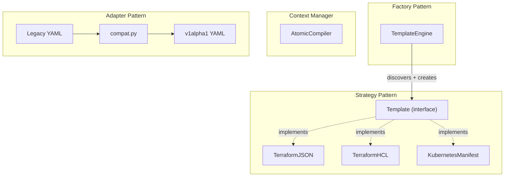

---

## 10. Future: Agentic Architecture (Option A)

An LLM agent sits between the user and Geni, translating natural language requirements into target YAML. The human retains full review authority before any compilation or deployment occurs.

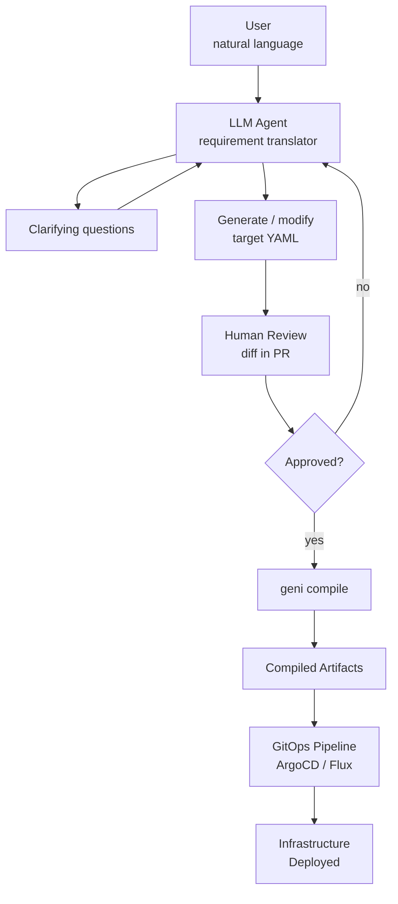

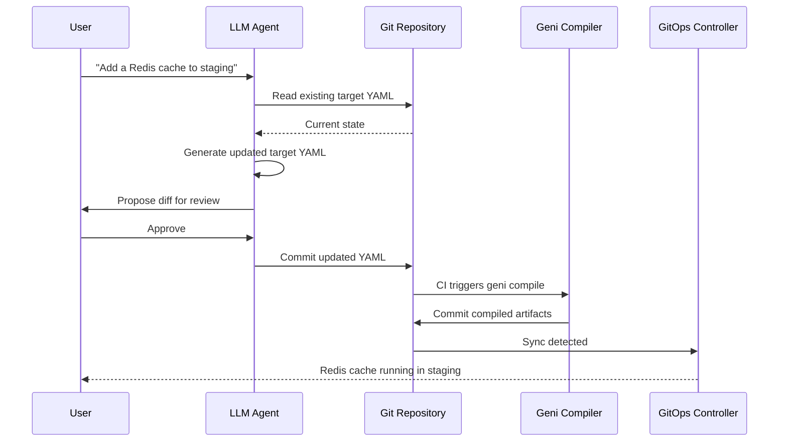

The agent's job is **requirements to YAML**. Geni's job is **YAML to infrastructure**. The YAML is the contract between them -- human-readable, git-tracked, reviewable. The agent never bypasses the compiler or deploys directly.
