# Geni Architecture

Comprehensive architecture documentation for Geni, a Python-powered infrastructure-as-code generator.

---

## 1. System Overview

Geni takes declarative YAML target files and generates concrete infrastructure artifacts -- Terraform configurations, Kubernetes manifests, and Helm charts.

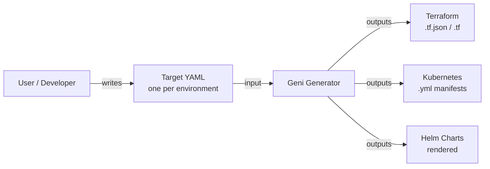

The generator acts as a single translation layer between human-authored declarations and tool-specific output formats. One YAML file per environment drives all infrastructure generation consistently.

---

## 2. Core Architecture

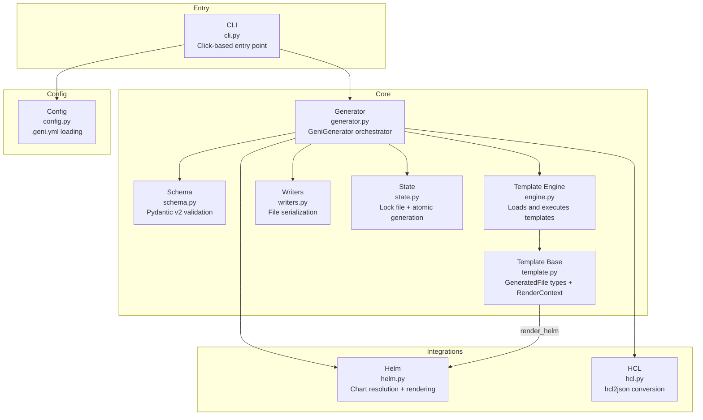

| Module | File | Responsibility |
|-----------|------|---------------|
| **CLI** | `cli.py` | Parses commands and flags, dispatches to the generator |
| **Generator** | `generator.py` | Central orchestrator -- validation, rendering, output |
| **Schema** | `schema.py` | Pydantic models for target YAML validation |
| **Engine** | `engine.py` | Discovers, loads, and executes templates |
| **Templates** | `template.py` | Base classes, GeneratedFile types, and RenderContext with built-in helpers |
| **Writers** | `writers.py` | Serializes GeneratedFile objects to disk |
| **State** | `state.py` | Lock files and atomic staging/swap |
| **Helm** | `integrations/helm.py` | Chart resolution (local + registry) and rendering |
| **HCL** | `integrations/hcl.py` | HCL-to-JSON conversion via hcl2json |
| **Config** | `config.py` | Project-level `.geni.yml` configuration |

---

## 3. Generation Flow

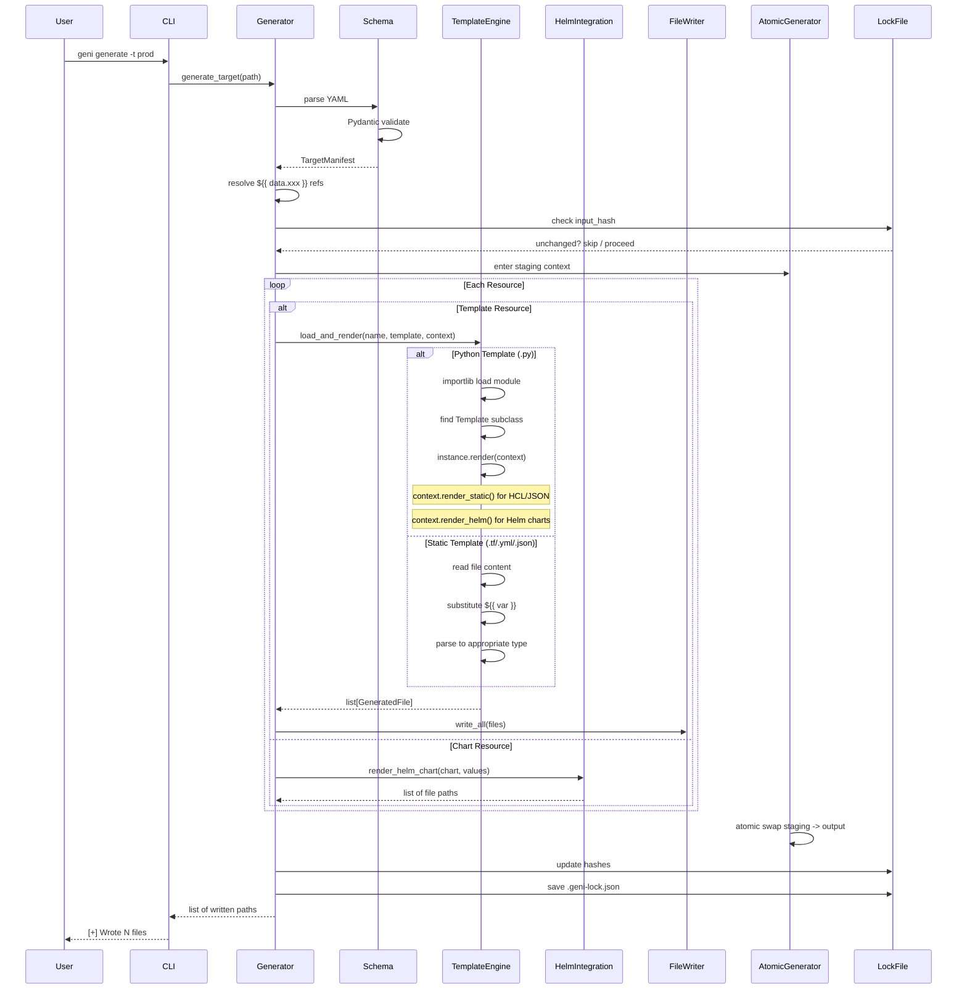

Key properties:

- **Validation-first**: target YAML is fully validated before any rendering begins
- **Reference resolution**: `${{ data.xxx }}` refs resolved after validation, before rendering
- **Atomic output**: files written to staging, swapped in one operation -- no partial writes

---

## 4. Template System

### Three Rendering Paths

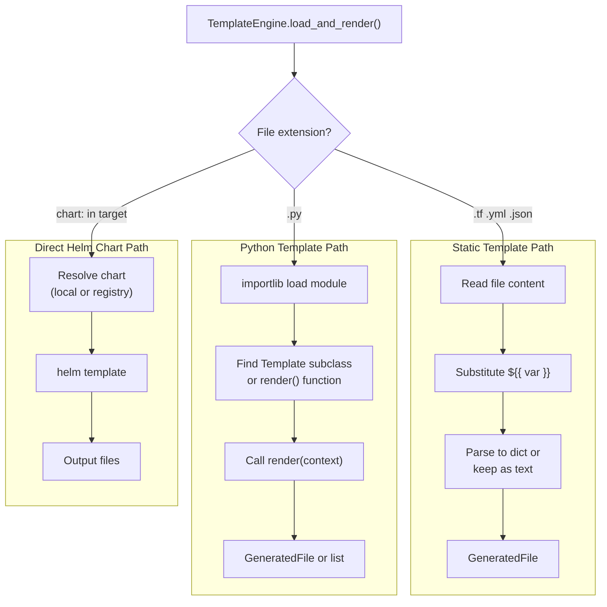

### RenderContext Built-in Helpers

Python templates receive a `RenderContext` that provides helper methods for composing output from other sources:

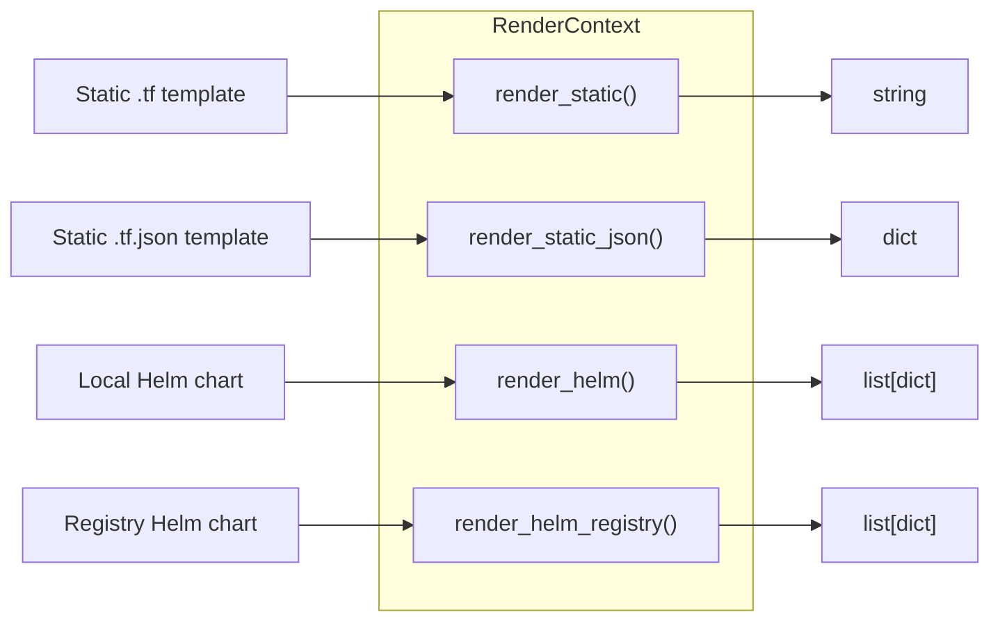

| Method | Input | Returns | Use Case |
|--------|-------|---------|----------|
| `render_static(path, params)` | `.tf`, `.yml`, text template | `str` | Render HCL/text with substitution |
| `render_static_json(path, params)` | `.tf.json`, `.json` template | `dict` | Render JSON, get parsed dict |
| `render_helm(chart, ...)` | Local Helm chart path | `list[dict]` | Render chart, get parsed manifests |
| `render_helm_registry(repo, name, version, ...)` | Registry chart coordinates | `list[dict]` | Pull + render registry chart |

### Class Hierarchy

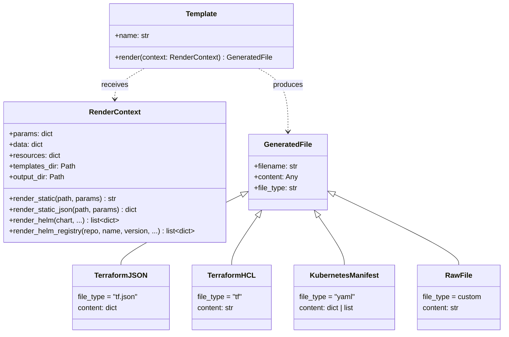

**Static templates** are files with `${{ var }}` placeholders. Best for simple, mostly-literal configurations.

**Python templates** extend the `Template` base class with full Python logic -- loops, conditionals, API calls, multi-file output. They can call `render_static()` to reuse HCL/JSON templates or `render_helm()` to render and customize Helm charts programmatically.

**Direct Helm charts** are referenced via `chart:` in the target YAML and rendered as-is via `helm template`.

---

## 5. Target YAML Schema

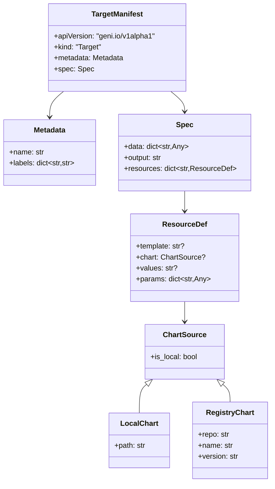

Each resource must specify exactly one of `template` or `chart`. The `params` dict is passed to the template at render time, with `${{ data.xxx }}` references resolved from the top-level `data` block.

---

## 6. State Management

### Atomic Generation

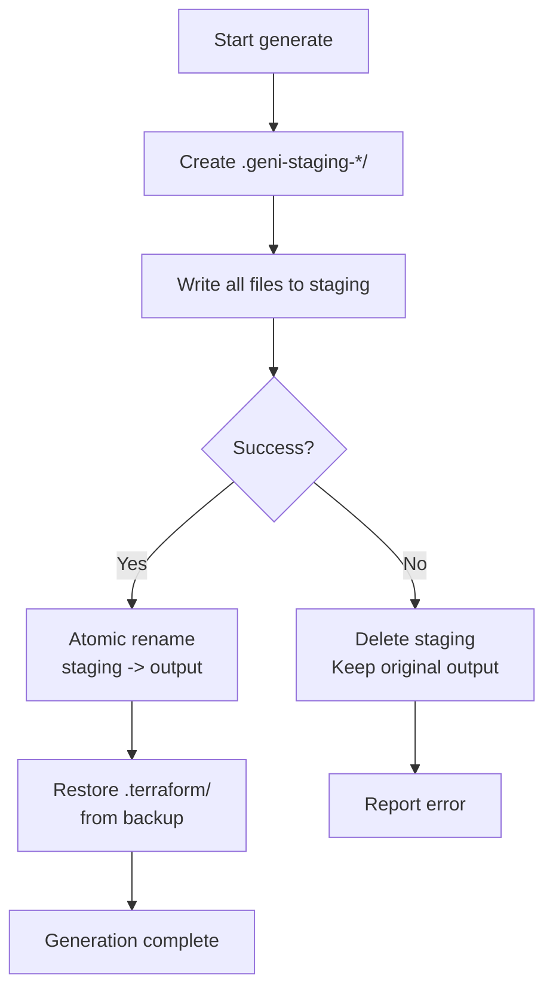

### Incremental Generation

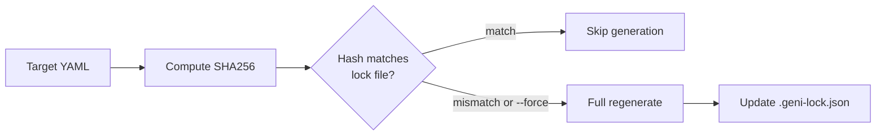

Lock file structure (`.geni-lock.json`):

```json
{
  "version": 1,
  "generated_at": "2026-03-19T09:17:43+00:00",
  "targets": {
    "example-prod": {
      "input_hash": "sha256:abc123...",
      "outputs": {
        "backend.tf.json": "sha256:def456...",
        "provider.tf.json": "sha256:789abc..."
      }
    }
  }
}
```

The `.terraform/` directory is preserved across generations -- it is backed up before swap and restored after.

---

## 7. Plugin Architecture

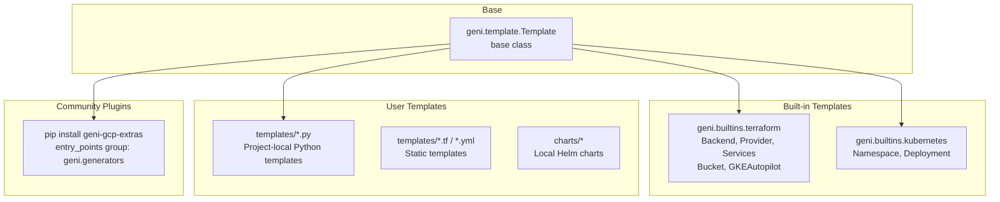

Templates are discovered from three sources:

1. **Local templates** -- files in the project's `templates/` directory (referenced by relative path)
2. **Built-in templates** -- shipped with Geni in `geni.builtins`
3. **Community plugins** -- installed via pip, registered under `geni.generators` entry points

Helm charts can be local (in `charts/` directory) or pulled from registries.

---

## 8. User Workflows

### New Project

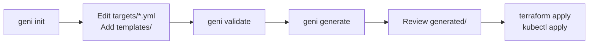

### Development Cycle

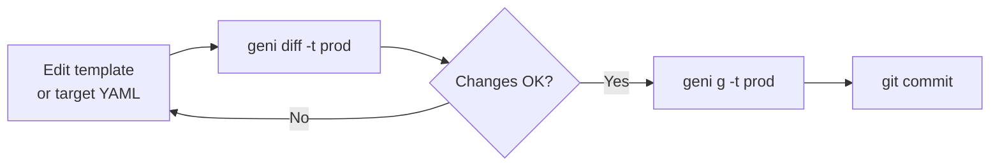

### CI/CD Pipeline


---

## 9. Design Patterns

| Pattern | Where | Purpose |
|---------|-------|---------|
| **Strategy** | `TemplateEngine._render_python_template` vs `_render_static_template` | Different rendering strategies based on file type |
| **Factory** | `TemplateEngine.load_and_render` | Discovers and instantiates Template subclasses dynamically |
| **Builder** | `GeneratedFile` subclasses (`TerraformJSON`, `KubernetesManifest`) | Construct output artifacts with type-specific defaults |
| **Context Manager** | `AtomicGenerator.__enter__/__exit__` | Safe staging/swap with automatic cleanup on failure |
| **Template Method** | `Template.render()` | Base class defines interface, subclasses implement logic |
| **Facade** | `GeniGenerator` | Single interface over engine, writers, state, and integrations |
| **Composition** | `RenderContext.render_static/render_helm` | Templates compose output from other templates and Helm charts |

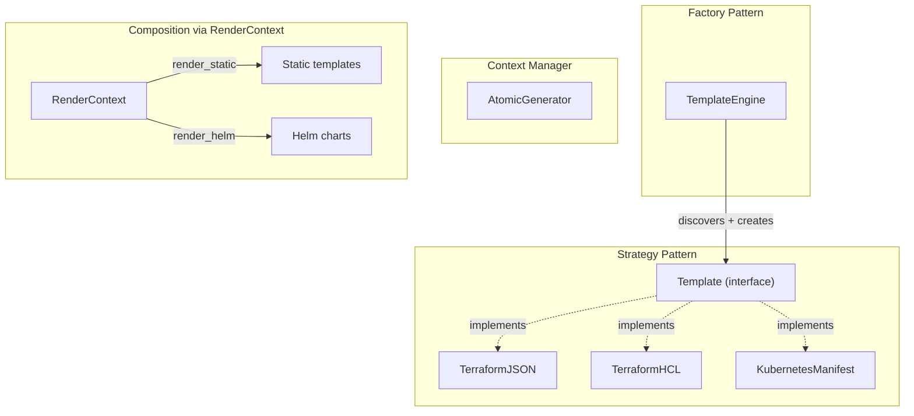

---

## 10. Future: Agentic Architecture

An LLM agent sits between the user and Geni, translating natural language requirements into target YAML. The human retains full review authority before any generation or deployment occurs.

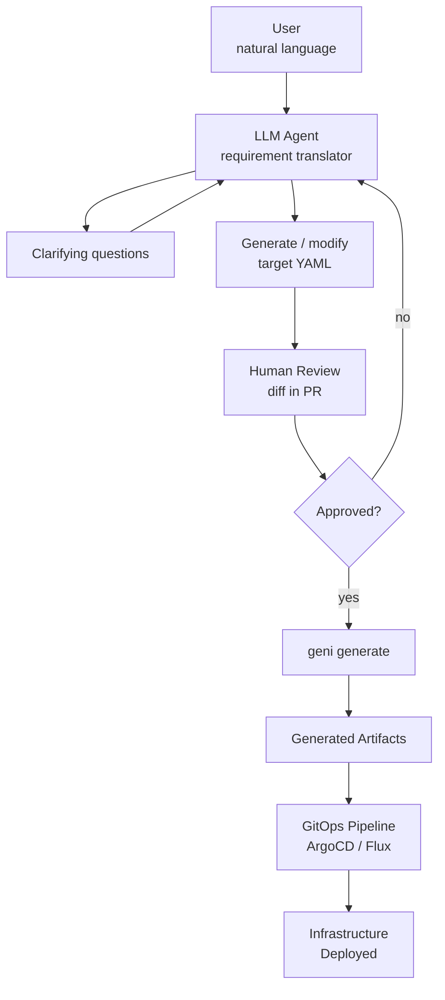

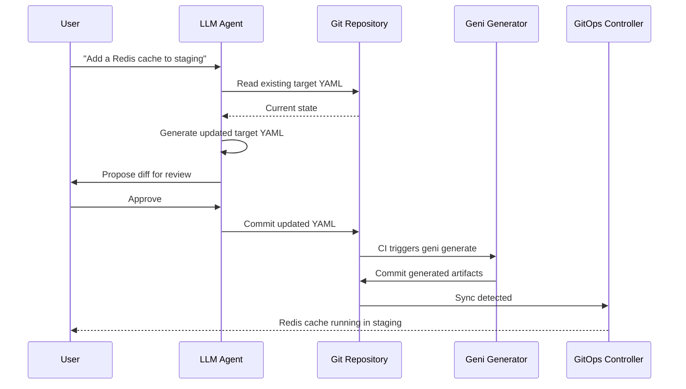

The agent's job is **requirements to YAML**. Geni's job is **YAML to infrastructure**. The YAML is the contract between them -- human-readable, git-tracked, reviewable. The agent never bypasses the generator or deploys directly.
